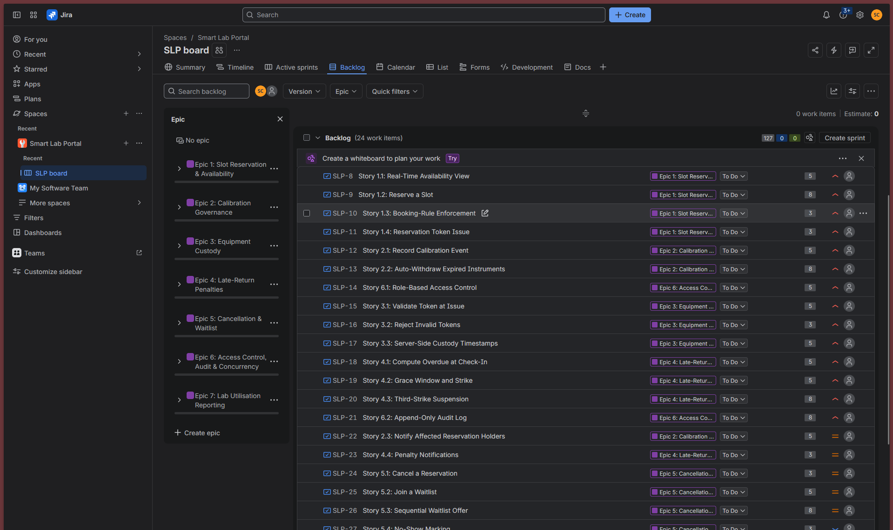
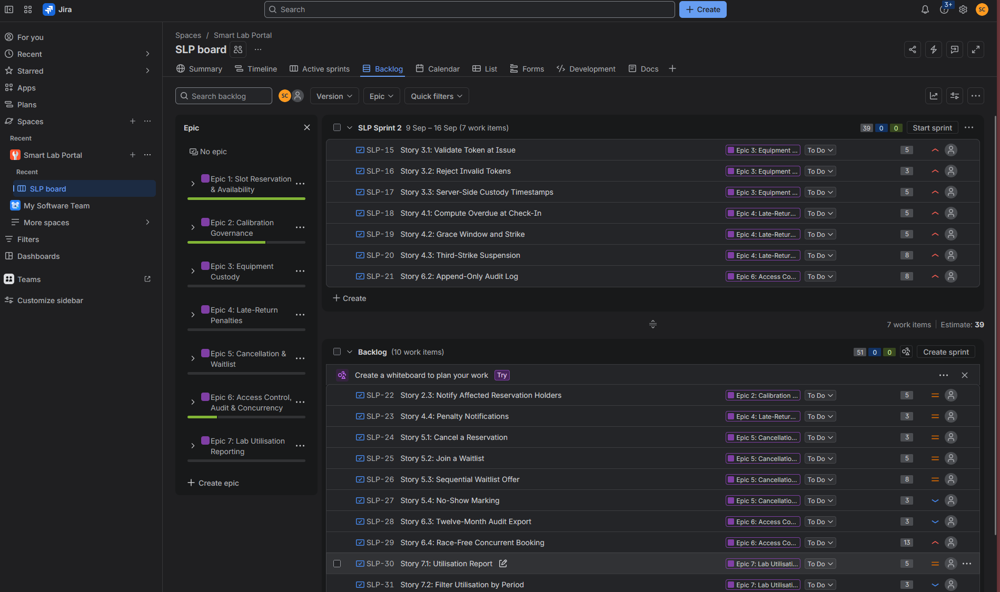
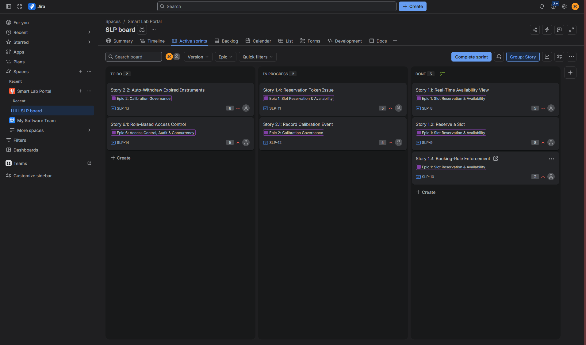
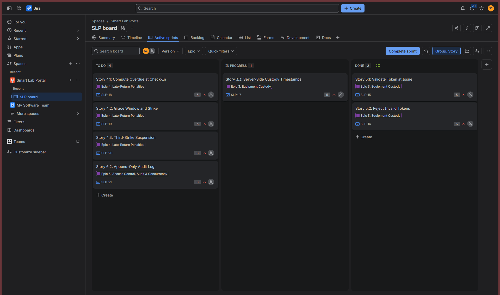
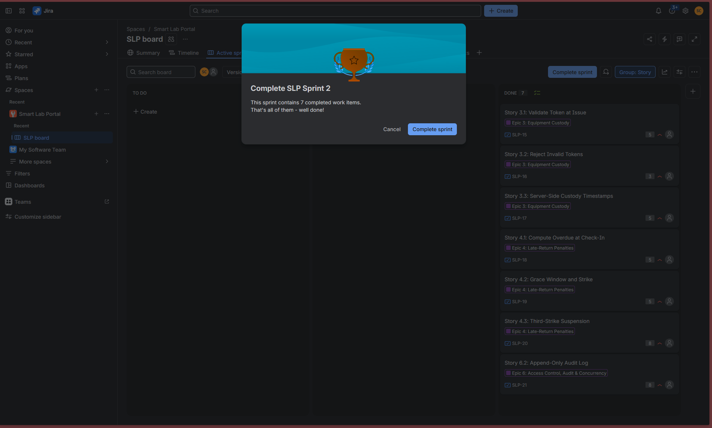
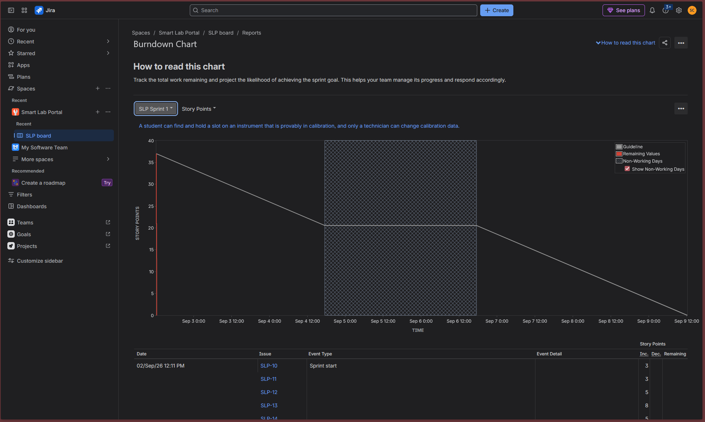
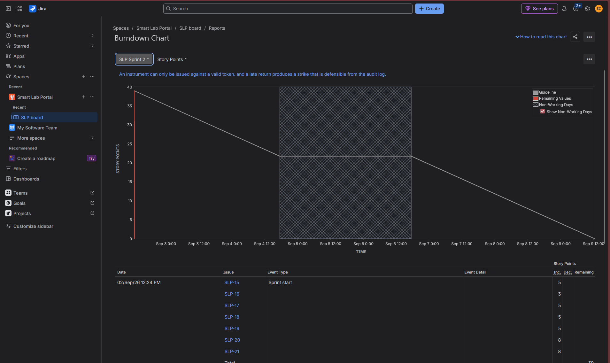
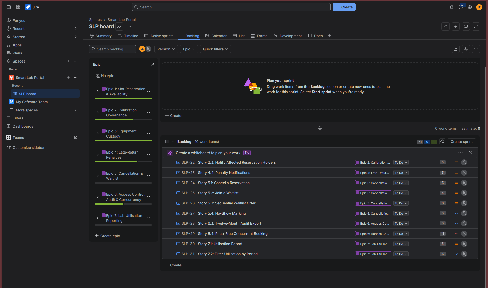

# SE Lab 2 — Agile Backlog Creation & Sprint Simulation in Jira

**Smart Lab Equipment & Slot Reservation Portal**
PES University — Dept. of CSE · Problem Statement #01

Continues [Lab 1](https://github.com/santoshcheethiralame-dot/PES1UG24CS127_LAB-01), which
produced the requirements table and the UML use-case model. This lab turns those
requirements into an Agile backlog and runs two sprints on it in Jira.

## Contents

| File | What it is |
|---|---|
| `Lab2_Deliverables.pdf` | Submission PDF — Epics and User Stories, sprint results, both burndown charts. |
| `Lab2_Reflection.pdf` | Submission PDF — the four reflection answers. |
| `BACKLOG.md` | 7 Epics, 24 User Stories, priorities, story points, and the two-sprint plan. Includes the requirement-to-Epic traceability table. |
| `jira_import.csv` | The same backlog as a Jira CSV import file, so the board can be populated without typing 31 work items by hand. |
| `REFLECTION.md` | Answers to the four reflection questions. |
| `screenshots/` | Backlog, story points, sprint boards, burndown charts, epic progress. |
| `src/build.py` | Regenerates both PDFs from the tables in this repo, `REFLECTION.md` and the screenshots. Shells out to headless Chrome for HTML-to-PDF, same as Lab 1. |

## Backlog at a glance

7 Epics · 24 Stories · **127 story points**

| Epic | Stories | Points |
|---|---|---|
| 1 — Slot Reservation & Availability | 4 | 19 |
| 2 — Calibration Governance | 3 | 18 |
| 3 — Equipment Custody | 3 | 13 |
| 4 — Late-Return Penalties | 4 | 21 |
| 5 — Cancellation & Waitlist | 4 | 19 |
| 6 — Access Control, Audit & Concurrency | 4 | 29 |
| 7 — Lab Utilisation Reporting | 2 | 8 |

Sprint 1: 37 points · Sprint 2: 39 points · remaining backlog: 51 points.

## Running the lab in Jira

Project setup: **Create → Software development → Scrum → Company-managed**, name
`Smart Lab Portal`, key `SLP`.

### Fast path — CSV import

Company-managed projects accept a CSV import, which populates all 7 Epics and 24 Stories
with descriptions, priorities and story points in one pass.

1. **Settings (gear) → System → External System Import → CSV**, upload `jira_import.csv`.
2. Select the `SLP` project.
3. On the field-mapping screen, map:
   - `Summary` → Summary
   - `Issue Type` → Issue Type (or Work Type)
   - `Description` → Description
   - `Priority` → Priority
   - `Story Points` → Story point estimate
   - `Epic Name` → Epic Name — if that field is not offered, leave it unmapped
   - `Epic Link` → Parent (or Epic Link, depending on what the mapping screen shows)
   - `Sprint` → Sprint, ticking the option to create missing sprint values
4. Import, then open **Backlog** and confirm the stories sit under their Epics.

The parent-link field is the one part of this that varies between Jira versions — recent
Jira Cloud renamed *Epic Link* to *Parent*, and some sites expose only one of the two. If
neither maps cleanly, import without that column and attach the stories to Epics in the
backlog view afterwards: open a story, set **Parent** to its Epic. Do the Epic rows first
so the Epics exist before the stories reference them.

### Manual path

If the import screen is unavailable, work straight from the tables in `BACKLOG.md`:

1. **Backlog → Create → work type Epic.** Create all 7 Epics with the summary and
   description given. Press `E` to show the Epic panel.
2. For each Epic, use **Create work item** on the Epic panel so the parent is filled in
   automatically. Work type **Story**. Summary is the story title; the description is the
   As a / I want / So that lines from the table.
3. Set **Priority** in the Create dialog — the default is Medium, so only the High and Low
   stories need changing.
4. Set **Story Points** from the detail panel: **More fields → Story Points**.

### Sprints

1. Tick the 7 Sprint 1 stories in the backlog, drag them into **SLP Sprint 1**.
2. **Start sprint** — duration **1 week**, sprint goal from `BACKLOG.md`.
3. On **Active sprints**, move each card To Do → In Progress → Done.
4. **Complete sprint**, then repeat for Sprint 2 with its 7 stories.

### Burndown chart

**Reports → Burndown Chart**, with the estimation statistic set to **Story Points**. Take
one chart per sprint.

## Result

| Sprint | Started | Items | Points | Completed |
|---|---|---|---|---|
| SLP Sprint 1 | 02/Sep/26 12:11 PM | 7 | 37 | 7 of 7 |
| SLP Sprint 2 | 02/Sep/26 12:24 PM | 7 | 39 | 7 of 7 |
| Backlog remaining | — | 10 | 51 | — |

Both sprints were time-boxed to one week ending 09/Sep/26. Epics 1–4 closed completely,
Epic 6 partially (13 of 29 points), Epics 5 and 7 untouched.

## Screenshots

### Backlog with Epics and User Stories

Epic panel showing all 7 Epics, 24 User Stories in the backlog, 127 story points estimated.

### Story point assignments

Sprint 2 loaded with 7 items totalling 39 points. Per-story points on the right, priority
icons beside them, Epic chip on every row, 51 points left in the backlog below.

### Sprint boards

Sprint 1 mid-sprint — 2 To Do, 2 In Progress, 3 Done.

Sprint 2 mid-sprint — 4 To Do, 1 In Progress, 2 Done.

### Sprint completion

### Burndown charts

Sprint 1, 37 points, estimation statistic set to Story Points.

Sprint 2, 39 points.

### Epic progress after both sprints

Epics 1–4 complete, Epic 6 partially complete, Epics 5 and 7 not started. 10 work items and
51 story points remain in the backlog.

## Note on the demo

The handout requires the Jira workspace to be demonstrated live to the instructor. Keep the
site reachable and both sprints closed before the review.
